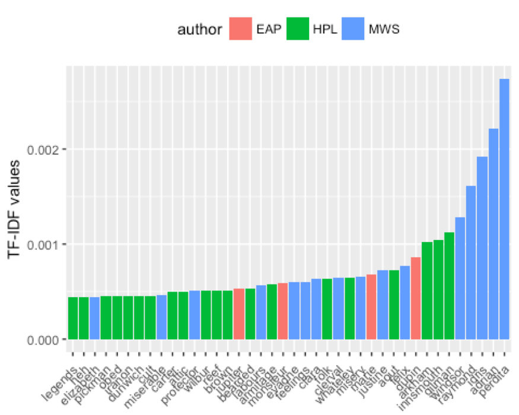
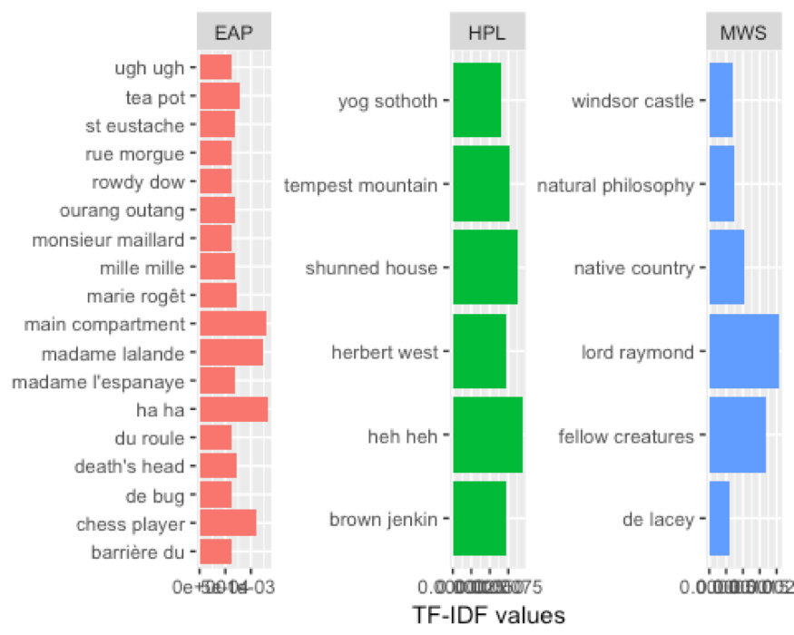
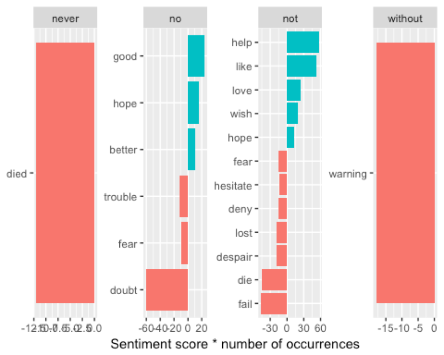
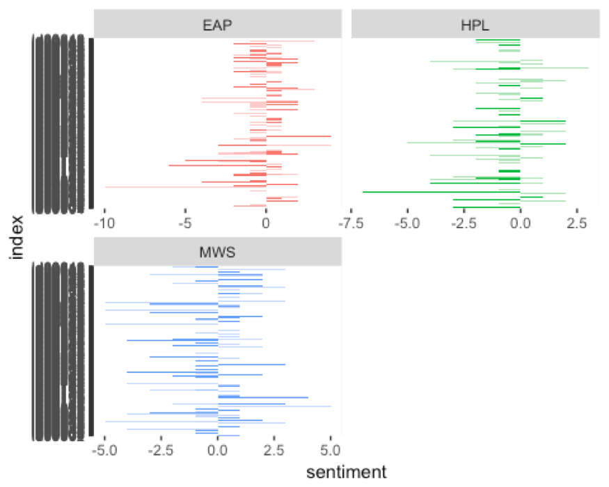
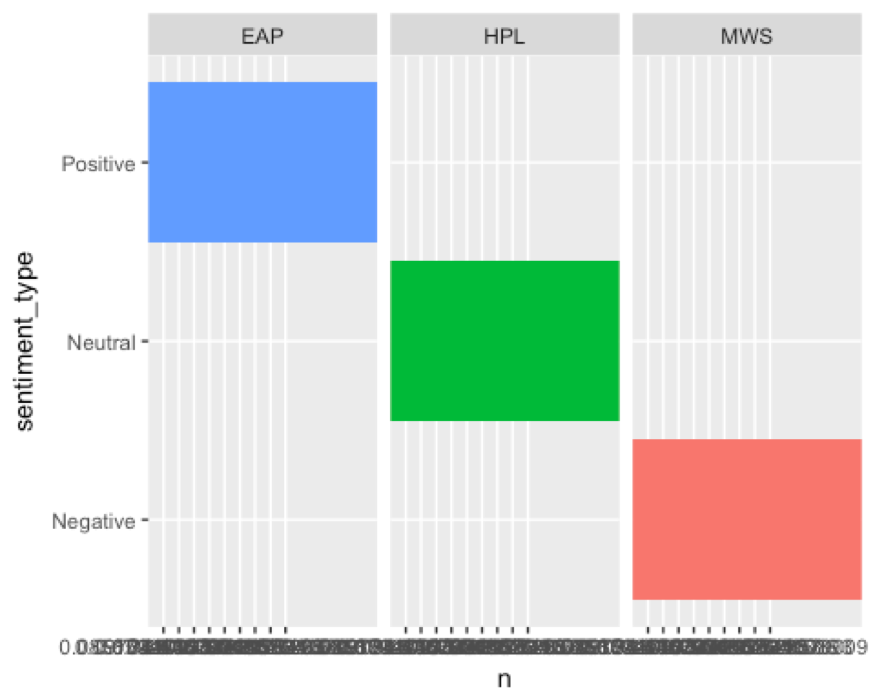
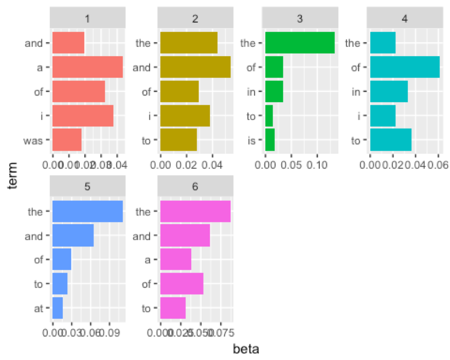
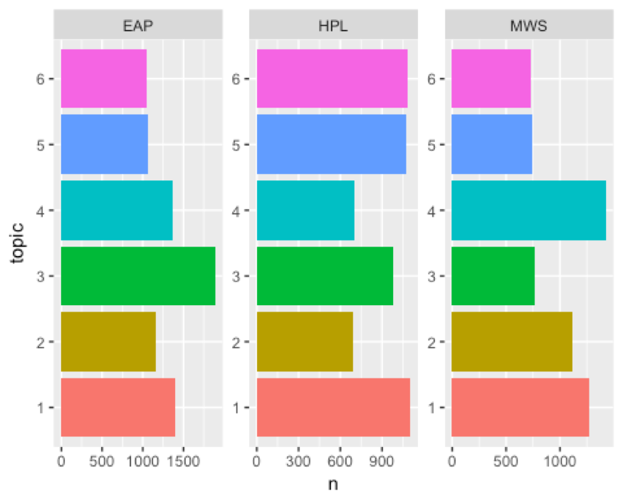

# Spring2018
# Project 1: An R Notebook Data Story on Horror Stories
----

### Project Description
This is the first and only *individual* (as opposed to *team*) this semester. 

Term: Spring 2018

+ Project title: An R Notebook Data Story on Horror Stories
+ This project is conducted by Cindy Xu
+ Project summary: For this project we're going to work with some SPOOKY data, and do analysis  to get information about characters for Poe, Lovecraft, and Mary Shelley to compare their difference and similiarities.

## What words appear most in spooky data?

Base on single word level

Note that in the above, many of the words recognized by their tf-idf scores are names. 

Base on bigram level

Get frequency for phrases based on different authors

###Sentiment Analysis
In the sentiment analysis part, we want to measure what is the proportion of the sentiment was positive or negative.

negate word

We can get how words represent the level of sentiment

trajectory of the story

We can see how the plot of each author changes toward more positive or negative sentiment over the trajectory of the story.

Base on sentense level do sentiment

Poe, Lovecraft, Shelly are positive, neutral, and negative compare to each other.

###Topic Modeling

pick 6 topics

Pick 6 topics to avoid some duplications.

author topics

From plot, we learn different author focus on diffrernt topics. And combine 5 top words for each topics, we can get theme for each author.

