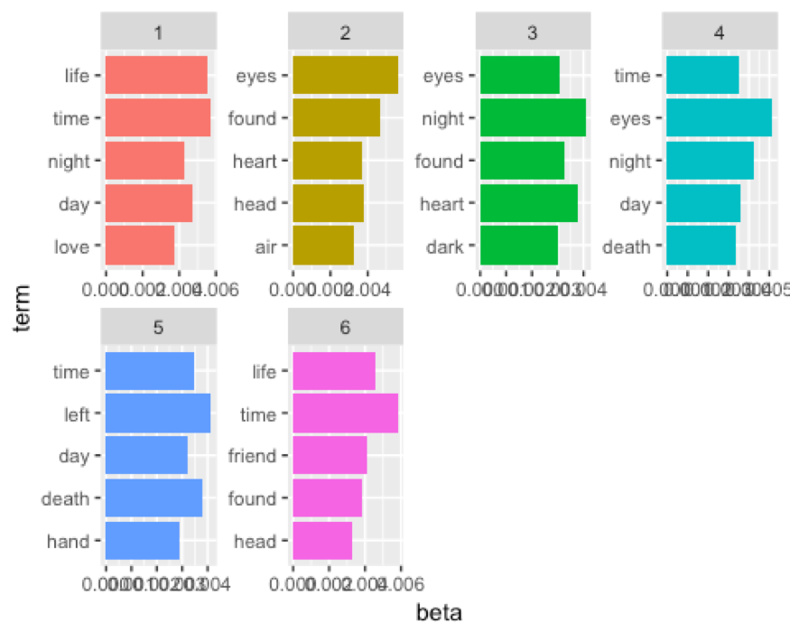

# Spring2018
# Project 1: An R Notebook Data Story on Horror Stories
----

### Project Description
This is the first and only *individual* (as opposed to *team*) this semester. 

Term: Spring 2018

+ Project title: An R Notebook Data Story on Horror Stories
+ This project is conducted by Cindy Xu
+ Project summary: For this project we're going to work with some SPOOKY data, and do analysis  to get information about characters for Poe, Lovecraft, and Mary Shelley to compare their difference and similiarities.

## What words appear most in spooky data?

Base on single word level

Note that in the above, many of the words recognized by their tf-idf scores are names. This makes sense – if we see text referencing Raymond, Idris, or Perdita, we know almost for sure that MWS is the author. But some non-names stand out. EAP often uses “monsieur” and “jupiter” while HPL uses the words “bearded” and “attic” more frequently than the others. We can also look at the most characteristic terms per author.

Base on bigram level

From this plot, I would say EAP prefer more colorful phrases in order to avoid repeating in his story. HLP and MWS, phrases in their stories are in less variation.

## Sentiment Analysis
In the sentiment analysis part, we want to measure what is the proportion of the sentiment was positive or negative.

Negate word

“not doubt” and “not help” are the two most common examples, we can also see pairings such as “no hope” and “never forget.” We can see how these negate phrases make text more positive or more negative than it is. 

Trajectory of the story

We can see how the plot of each author changes toward more positive or negative sentiment over the trajectory of the story. Like, MWS is more emotional than others with high variation for trajectory of the story.

Base on sentense level do sentiment

Poe has more positive sentenses, Lovecraft has more neutral sentences and Shelly has more negative sentenses.

## Topic Modeling

Pick 6 topics

Compare 6, 12 topic, I would suggest 6, because when u pick 12, there are some kind of of duplicated. 

In the above, we see that the first topic is characterized by words like "love", "life", and "time" while the third topic includes the word "eyes", and the fifth topic the word "death".  Note that the words "life" and "time" appear in many topics.  This is the advantage to topic modelling as opposed to clustering when using natural language -- often a word may be likely to appear in documents characterized by multiple topics.

Author topics

From plot, we learn different author focus on diffrernt topics. And combine 5 top words for each topics, we can get theme for each author. Like, EAP focuses on topic 6 which is about life, time and friends. HPL focuses on topic 6 and 5 which are about life, time and death. MWS focuses on topic 1 which are about life, time and love. I would say the theme of EAP and HPL are similar, and the theme of MWS is different from others.

